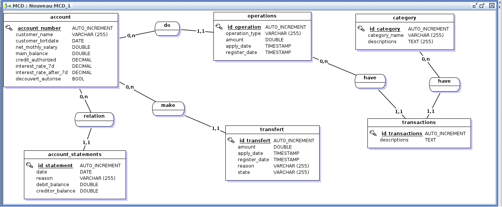

# DigitBank

## Description
The application enables clients to manage their bank accounts digitally, including account creation, balance inquiry, transfers, expense tracking, and transaction categorization for visualizing financial data through an interactive dashboard.

## Feature

The implementation of database is [here](./DigitBank/doc/Base/mcd2.png)

And here is the `database modelization`



If you need more information ,we have the API [here](./DigitBank/doc/api.yaml)

```sh

https://petstore.swagger.io/?url=https://raw.githubusercontent.com/KevinDonovan2/DigitBank/preprod/DigitBank/doc/api.yml

```

## Getting Started
you just need to run the `DigitBankApplicationTests.java`

And after that run in your browser `http://localhost:8080/`

```sh

http://localhost:8080/

```